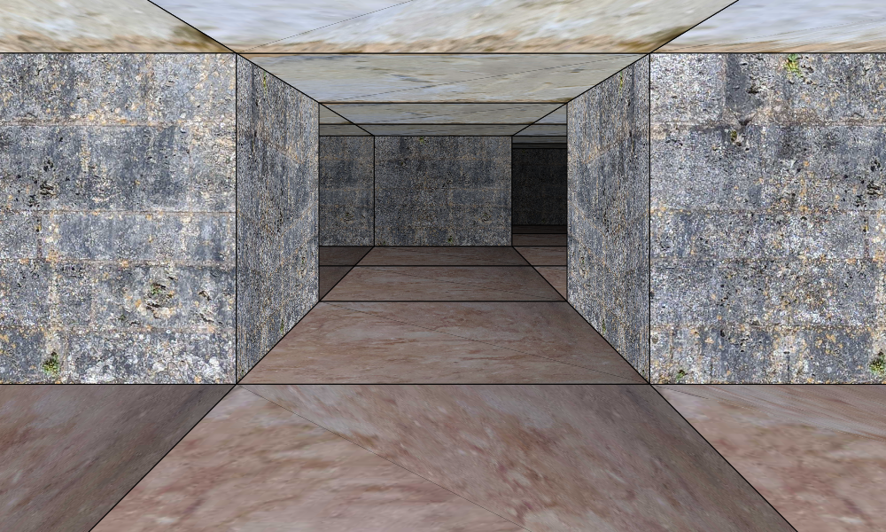

# JavaScript Dungeon Crawler Renderer

A plain JavaScript renderer with a first-person, pseudo-3D, grid-based viewport.

The 2D canvas-based renderer with texturing is in the style of Wizardry, Bard's Tale, and other grid-based dungeon crawlers.

- Texture dimensions: 800x600
- File format: .JPG
